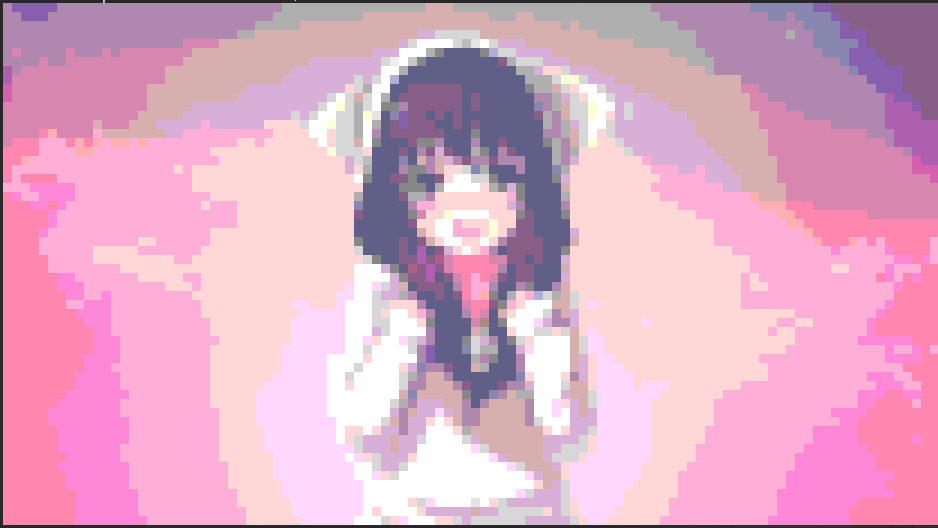
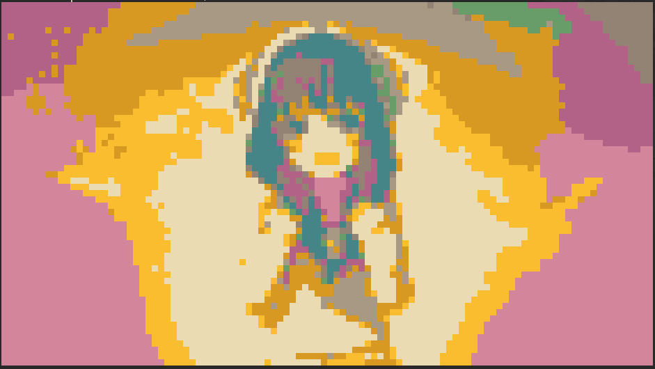
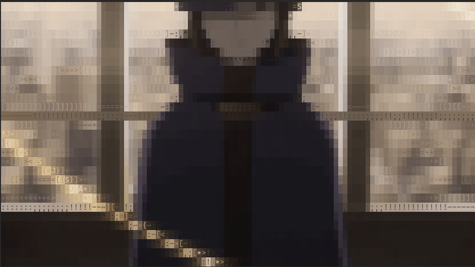
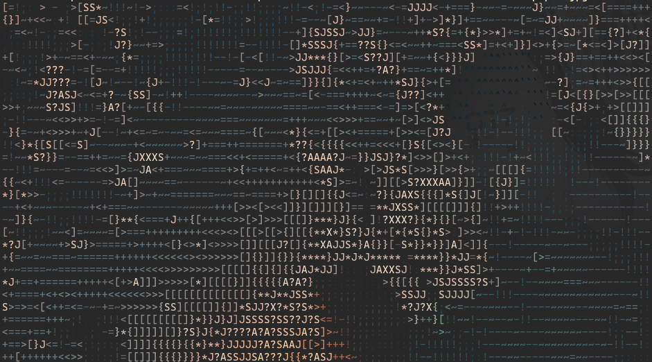

# pxv
Instant feature rich terminal image viewer (as fast as [catimg](https://github.com/posva/catimg), if not faster).

 
 

 

## Installation

### 1 Source
Compilation of this repository requires [dlang](https://dlang.org).

1. Clone [this repo](https://github.com/al1-ce/pxv) and build it with `dub build -b release`
2. Copy created binary `./bin/pxv` to somewhere in your path, for example `~/.local/bin/`

### 2 Binary

1. Go to [releases](https://github.com/al1-ce/pxv/releases) and download binary.
2. Copy downloaded binary `pxv` to somewhere in your path, for example `~/.local/bin/`

### 3 AUR

1. Install with any package manager of your choice. Assuming you have `yay` install with `yay -Syu pxv` or if you have [`pkm`](https://github.com/al1-ce/pkm) install with `pkm install pxv`

### 4 dub

1. Fetch package with `dub fetch pxv`
2. Build and install into `/usr/bin` with `dub build pxv -b release -c install`

## Options

| Flag | Description | Notes |
| :- | :- | :- |
| -c, --columns | Sets width/columns. | Can be used together with `-r` to set custom image size |
| -r, --rows | Sets height/rows. | If `-c` and `-m` are not set will change `-m` to `height` |
| -s, --size | Matches set dimention. Must be one of: width, height, fit. | Fit option will fit image automatically. Defaults to width. Gifs are always matching to fit
| -C, --color | Sets color type. Must be one of: ansi8, ansi256, truecolor. | ansi8 prints with `\e[$1m`, ansi256 with `\e[38;5;$1m` and truecolor with `\e[38;2;$1m` |
| -g, --grayscale | Prints image in grayscale. | Keeps `-C` palette. |
| -l, --lowres | Renders image in half of resolution. | Must be turned on if your terminal doesn't have support for unicode since by default pxv prints with "▀" and "▄". |
| -i, --ascii | Uses ascii palette. | Default palette is `` .`^,:;!-~=+<>[]{}*JS?AX#%@`` |
| -p, --palette | Sets ascii palette for output. | Works only with `-i` flag. |
| -b, --background | Disables background. | Does not work when using `-l` without `-i`. |
| -o, --once | If image is gif and flag is set then it's going to do only one loop |  |
| -S, --still | Shows only first frame in gif | Marks image as not gif |
| -f, --frame | Shows only N frame in gif | Marks image as not gif |
<!-- | -u, --unicode | Uses unicode to mimic image as much as possible. | Inspired by [tiv](https://github.com/stefanhaustein/TerminalImageViewer) and [playscii](http://vectorpoem.com/playscii/) | -->

### Screenshots
#### Truecolor

#### Ansi256

#### Ansi8

#### TrueColor + Ascii

#### Ascii + NoBackground

#### GIFs (excuse compression artifacts)

